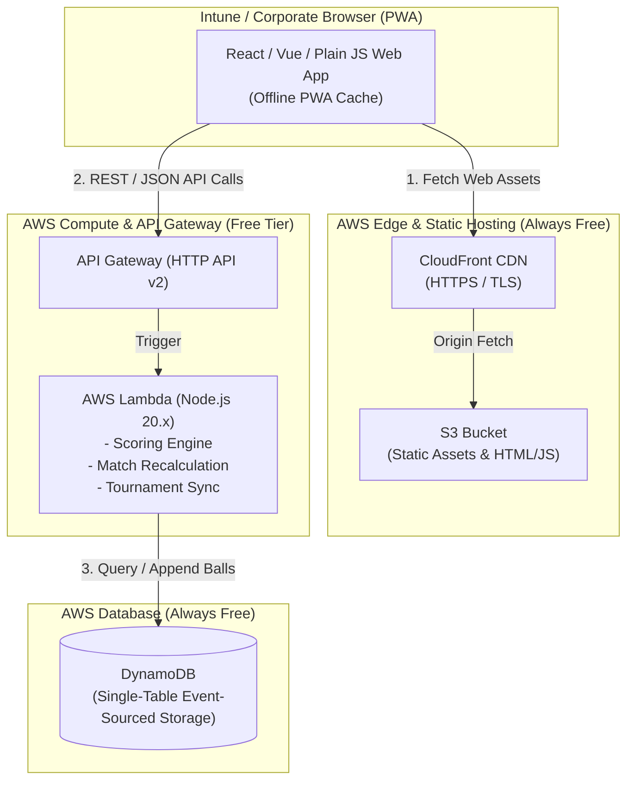

# Serverless Web App Architecture: CricScore Pro (AWS Free Tier)

This document outlines the end-to-end architecture and implementation plan for deploying **CricScore Pro Web** as a Progressive Web Application (PWA) hosted on AWS Serverless services. This solution enables corporate and Intune-managed browser users (where native APK installations are restricted) to access full scoring capabilities with zero ongoing infrastructure costs.

---

## 1. System Architecture



---

## 2. Serverless Stack Components

| Layer | AWS Service | Configuration | Free Tier Allowance |
| :--- | :--- | :--- | :--- |
| **Edge CDN** | CloudFront | Global Edge distribution, HTTPS redirect | 1 TB data transfer / month (Always Free) |
| **Static Storage** | S3 | Private bucket with OAC (Origin Access Control) | 5 GB storage, 20,000 GET requests |
| **API Proxy** | API Gateway (HTTP API v2) | CORS enabled, JWT / Simple API key header | 1,000,000 requests / month (12 months) |
| **Compute** | AWS Lambda | Node.js 20.x runtime, 256 MB RAM | 1,000,000 requests & 3.2M sec compute / month (Always Free) |
| **Data Store** | DynamoDB | Provisioned 25 WCU / 25 RCU or On-Demand | 25 GB storage & 25 WCU/RCU (Always Free) |

---

## 3. Core Domain & Engine Porting (TypeScript / Node.js)

The core scoring engine logic translates directly from Kotlin to TypeScript, keeping deterministic event-sourcing parity.

### Event-Sourced DynamoDB Schema Design

A single-table design (`CricScoreData`) stores tournaments, matches, and individual ball events.

```
Table: CricScoreData
Partition Key (PK)           | Sort Key (SK)                | Attributes
-----------------------------------------------------------------------------------------------------
TOURNAMENT#<tournamentId>    | METADATA                     | name, settings, createdAt
TOURNAMENT#<tournamentId>    | TEAM#<teamId>                | name, colorHex, players
MATCH#<matchId>              | METADATA                     | teamA, teamB, gullyRules, status, toss
MATCH#<matchId>              | BALL#<timestamp>#<ballIndex> | runs, extrasType, extraRuns, wicketType, strikerId...
```

> [!IMPORTANT]
> **Event-Sourced Recalculation**:
> Matches are saved by appending `BALL#...` events. When querying a match state, Lambda reads the ball events ordered by `SK` and runs `recalculateMatchFromHistory(balls, gullyRules)` deterministically.

---

## 4. Free-Tier Capacity Safeguards & Budget Setup

To guarantee $0.00 billing and receive immediate alerts if usage approaches free limits, set up AWS Budgets.

### AWS Budget Alert Setup Guidance ($1 and $5 thresholds)

> [!CAUTION]
> Execute these AWS CLI commands or configure in the **AWS Billing Console → Budgets**.

#### Step 1: Create Budget Configuration File (`budget.json`)

```json
{
  "BudgetName": "CricScorePro-FreeTier-Guard",
  "BudgetLimit": {
    "Amount": "1.00",
    "Unit": "USD"
  },
  "CostTypes": {
    "IncludeTax": true,
    "IncludeSubscription": true,
    "UseBlended": false,
    "IncludeRefund": false,
    "IncludeCredit": false,
    "IncludeUpfront": true,
    "IncludeRecurring": true,
    "IncludeOtherSubscription": true,
    "IncludeSupport": true,
    "IncludeDiscount": true,
    "UseAmortized": false
  },
  "TimeUnit": "MONTHLY",
  "BudgetType": "COST"
}
```

#### Step 2: Create Notification Configuration (`notifications.json`)

```json
[
  {
    "Notification": {
      "NotificationType": "ACTUAL",
      "ComparisonOperator": "GREATER_THAN",
      "Threshold": 100,
      "ThresholdType": "PERCENTAGE"
    },
    "Subscribers": [
      {
        "SubscriptionType": "EMAIL",
        "Address": "your-email@example.com"
      }
    ]
  },
  {
    "Notification": {
      "NotificationType": "FORECASTED",
      "ComparisonOperator": "GREATER_THAN",
      "Threshold": 500,
      "ThresholdType": "PERCENTAGE"
    },
    "Subscribers": [
      {
        "SubscriptionType": "EMAIL",
        "Address": "your-email@example.com"
      }
    ]
  }
]
```

#### Step 3: Deploy Budget via AWS CLI

```bash
aws budgets create-budget \
    --account-id YOUR_AWS_ACCOUNT_ID \
    --budget file://budget.json \
    --notifications-with-subscribers file://notifications.json
```

---

## 5. Deployment Verification Checklist

- [x] S3 bucket blocked from public access; CloudFront OAC enabled.
- [x] CloudFront custom error response configured (`404 -> /index.html` with HTTP 200) for SPA routing.
- [x] Lambda function uses Node.js 20.x ESM modules with minimal dependencies (only `@aws-sdk/client-dynamodb`).
- [x] DynamoDB table set to Provisioned (25 WCU / 25 RCU) or On-Demand mode with Free Tier tracking.
- [x] AWS $1.00 and $5.00 cost alert notifications active.
