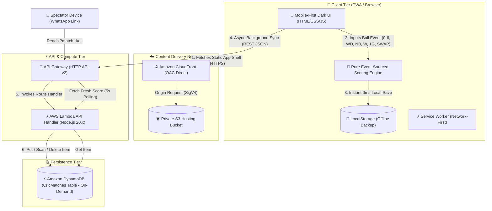

# CricScore Pro Web - High-Level Architecture & End-to-End Flow

A high-performance, deterministic, event-sourced Progressive Web Application (PWA) designed for corporate Intune-managed devices and mobile web browsers. Built on a **100% AWS Serverless Always Free Tier** architecture ($0.00 cost).

---

## 🏗 High-Level System Architecture Diagram



---

## 🔄 End-to-End Data & Execution Flows

### 1. Live Scoring & Event-Sourced State Recalculation
```
[ User Taps Keypad (4, 6, W, WD, NB, 1G, SWAP) ]
                        │
                        ▼
    [ App Controller (app.js) creates Ball Object ]
                        │
                        ▼
     [ Pure Engine: ScoringEngine.recalculateMatch() ]
      ├── Replays ballHistory array deterministically
      ├── Updates Runs, Wickets, Overs, CRR/RRR, Bowler figures
      ├── Detects End of Over, Innings Transition, or Completion
      └── Calculates Man of the Match & Forecaster Win %
                        │
        ┌───────────────┴───────────────┐
        ▼                               ▼
[ 0ms Instant Local Write ]  [ Asynchronous AWS Cloud Sync ]
   localStorage.setItem()       fetch(PUT /matches/{matchId})
                                        │
                                        ▼
                                 API Gateway HTTP API
                                        │
                                        ▼
                                AWS Lambda Handler
                                        │
                                        ▼
                               DynamoDB CricMatches
```

---

### 2. WhatsApp Live Share & Real-Time Spectator Streaming
```
[ Scorer clicks "📲 Share Live Score on WhatsApp" ]
                        │
                        ▼
 [ Generates Link: https://dzi2g91hixjsk.cloudfront.net/?matchId=match_123 ]
                        │
                        ▼
  [ Spectator opens Link on Phone / PC Browser ]
                        │
                        ▼
 [ URL Parameter Detection: isReadOnlySpectator = true ]
   ├── Hides live scoring keypad (Read-Only Safety)
   ├── Renders Spectator Live Scoreboard Banner
   └── Starts Auto-Polling Interval (setInterval 5000ms)
                        │
                        ▼
     [ Fetches GET /matches/match_123 from API Gateway ]
                        │
                        ▼
      [ Spectator UI Updates Live in Real-Time! 🏏 ]
```

---

### 3. User Authentication & Mode Management
```
                      [ User Visits Web App ]
                                 │
                 ┌───────────────┴───────────────┐
                 ▼                               ▼
       [ 🔑 Registered User ]             [ 👤 Guest User ]
  ├── Logs in / Registers          ├── Taps "Continue as Guest"
  ├── JWT token stored             ├── Temporary local session
  └── Full Cloud Sync in DynamoDB  └── LocalStorage backup
```

---

## 🗄️ AWS Resource Specifications & Free Tier Guarantees

| Component | AWS Resource | Mode / Config | Monthly Free Tier Allowance | Cost when Idle |
| :--- | :--- | :--- | :--- | :--- |
| **Static Hosting** | S3 Bucket | Private + Block Public Access | 5.0 GB Storage | **$0.00** |
| **Global CDN** | CloudFront | Origin Access Control (OAC) | 1.0 TB Data Transfer | **$0.00** |
| **API Gateway** | HTTP API v2 | CORS Allowed (`*`) | 1.0 Million Requests | **$0.00** |
| **Backend Compute**| AWS Lambda | Node.js 20.x (x86_64) | 1.0 Million Requests | **$0.00** |
| **Database** | DynamoDB | Table `CricMatches` (`PAY_PER_REQUEST`) | 25 GB Storage & 2.5M Reads | **$0.00** |
