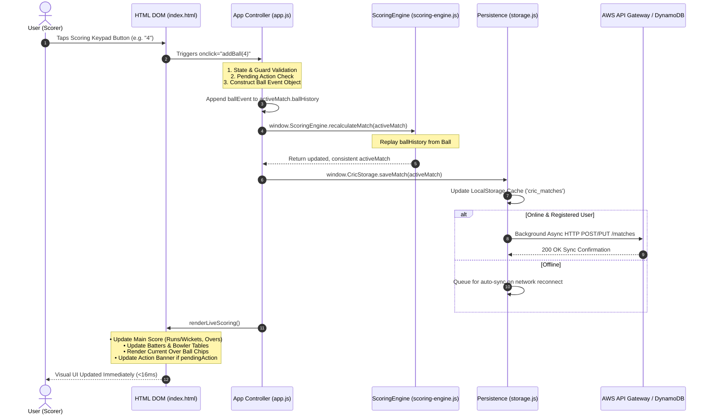

# Comprehensive Architecture & User Workflow Review
**Application:** CricScore Pro Web (PWA)
**Version:** 2.33.28
**Repository:** [CricketScorer-web](https://github.com/Ankojin/CricketScorer-web)
**Date:** 2026-09-25

---

## Executive Summary

CricScore Pro Web is a serverless, progressive web application (PWA) designed for offline-first cricket scoring with background AWS cloud synchronization.

The application strictly separates its **Presentation Layer**, **Application Controller**, **Scoring Engine Core**, and **Persistence Core**. This architectural boundary guarantees that UI modernizations or presentation changes never corrupt cricket rules, persisted match records, or cloud synchronization.

---

## 1. System Architecture Overview

```
┌─────────────────────────────────────────────────────────────────────────┐
│                        PRESENTATION / UX LAYER                          │
│   HTML5 Shell (index.html) · Unified Theme (styles.css) · Mobile PWA   │
└────────────────────────────────────┬────────────────────────────────────┘
                                     │ DOM events & Navigation
                                     ▼
┌─────────────────────────────────────────────────────────────────────────┐
│                     APPLICATION CONTROLLER (`app.js`)                   │
│   Screen Router · Session State · Modal Manager · Workflow Handlers    │
└──────────────────┬──────────────────────────────────────┬───────────────┘
                   │ Event-sourcing replay                │ Local / AWS API
                   ▼                                      ▼
┌──────────────────────────────────────┐  ┌──────────────────────────────────────┐
│        SCORING ENGINE CORE           │  │           PERSISTENCE CORE           │
│   src/engine/ScoringEngine.ts        │  │           public/js/storage.js       │
│   (Authoritative rules engine)       │  │   • LocalStorage Cache               │
│                   │                  │  │   • AWS Cloud API Gateway Sync       │
│                   ▼                  │  │   • Auth & Guest Isolation           │
│   public/js/scoring-engine.js        │  └──────────────────────────────────────┘
│   (Compiled browser bundle)          │
└──────────────────────────────────────┘
```

### 1.1 Architectural Layer Responsibilities

| Layer | Primary Files | Responsibilities | Key Design Principles |
| :--- | :--- | :--- | :--- |
| **Presentation** | `index.html`<br>`styles.css` | DOM structure, semantic HTML5 modal overlays, responsive CSS layout, design tokens. | Mobile-first (~44px touch targets), single unified Forest + Emerald + Cream design system. |
| **App Controller** | `app.js` | SPA screen routing, session management, UI event wiring, wizard step progression, modal state gates. | High performance, zero framework overhead, strict null-guards on DOM operations. |
| **Scoring Engine** | `src/engine/ScoringEngine.ts`<br>`public/js/scoring-engine.js` | Cricket rules, ball event replay, run rates (CRR/RRR), wicket attribution, bowler limits, NRR. | **Immutable & Isolated**. Compiled via `tsc` + `build-engine.js`. Never hand-edited in bundle form. |
| **Persistence** | `storage.js` | LocalStorage caching, guest vs registered user isolation, background AWS API Gateway / DynamoDB sync. | **Offline-first**. Offline actions succeed locally and automatically sync when online. |
| **PWA Shell** | `sw.js`<br>`manifest.json` | Offline asset caching, PWA installation, standalone app display mode. | Zero network latency for cached SPA assets. |

---

## 2. Core State Machine & Event Replay Engine

### 2.1 Event-Sourced Deterministic Replay Model
Cricket scoring state is maintained as an **immutable event stream of balls** (`ballHistory`).

When a ball is recorded, edited, or undone:
1. The ball event object is appended to, updated in, or removed from `match.ballHistory`.
2. `ScoringEngine.recalculateMatch(match)` runs a deterministic replay from ball #1 to the latest ball.
3. Totals, wickets, batter/bowler statistics, current run rate (CRR), required run rate (RRR), target, and current over ball chips are recalculated cleanly without accumulating drift errors.

```
Initial Match State
      │
      ├── + Ball Event (0, 1, 4, 6, WD, NB, WICKET...)
      │
      ▼
ScoringEngine.recalculateMatch() Replay Loop
      │
      ├──► Recalculate Batting Stats (runs, balls, 4s, 6s, SR, dismissal)
      ├──► Recalculate Bowling Stats (overs, maidens, runs, wickets, ECON)
      ├──► Recalculate Team Totals & Overs (legal ball increments)
      ├──► Evaluate Over Completions & Bowler Quota Limits
      └──► Evaluate Innings Completion & Target / Match Winner
      │
      ▼
Updated UI State & Persistence Save
```

### 2.2 Pending Action Gating Mechanism
To prevent invalid cricket states (e.g. scoring a ball without a bowler or striker selected), the application enforces a strict `pendingAction` state machine:

```
[ NONE ] ──► (Wicket) ──► [ WICKET_REQUIRED / SELECT_STRIKER ]
   ▲                              │
   │                              ▼
   ├────────── (Fielder) ◄── [ SELECT_FIELDER ]
   │
   ├────────── (Over Complete) ──► [ SELECT_BOWLER ]
   │
   └────────── (Toss Required) ──► [ TOSS_REQUIRED ]
```

---

### 2.3 End-to-End Technical Execution Flow (`HTML` → `app.js` → `ScoringEngine` → `storage.js` → `HTML`)

The end-to-end data and execution flow for a user action (such as tapping a run button or recording a wicket) follows a strict unidirectional data pipeline:



#### Detailed Execution Steps:
1. **User Action on HTML DOM (`index.html`)**:
   - The user taps a keypad control, e.g., `<button onclick="addBall(4)">4</button>`.
   - The browser dispatches a DOM click event directly to `app.js`.

2. **Controller Processing & Guard Checks (`app.js`)**:
   - `addBall(runs)` receives the user input.
   - Evaluates guards: `if (!activeMatch || isReadOnlySpectator || !ensureMatchLiveForScoring()) return;`.
   - Evaluates pending action state: if bowler or striker selection is needed, opens modal overlay and pauses scoring.
   - Constructs a structured, immutable ball event:
     ```javascript
     const ballEvent = {
       ballNumber: activeMatch.totalBalls + 1,
       runs: runs,
       extraType: 'NONE',
       extraRuns: 0,
       isWicket: false,
       strikerId: activeMatch.currentStrikerId,
       nonStrikerId: activeMatch.currentNonStrikerId,
       bowlerId: activeMatch.currentBowlerId,
       timestamp: new Date().toISOString()
     };
     ```
   - Appends `ballEvent` to `activeMatch.ballHistory`.

3. **Deterministic State Recalculation (`ScoringEngine.ts` / `scoring-engine.js`)**:
   - `app.js` invokes `activeMatch = window.ScoringEngine.recalculateMatch(activeMatch)`.
   - `ScoringEngine` replays the entire `ballHistory` sequentially from ball #1.
   - Re-evaluates runs, wickets, legal ball counts, dot balls, extras, striker rotations, over completions, bowler quota caps, and target chase conditions.
   - Returns the updated, fully consistent `activeMatch` data structure.

4. **Persistence & Background Cloud Sync (`storage.js`)**:
   - `app.js` calls `await window.CricStorage.saveMatch(activeMatch)`.
   - `storage.js` updates LocalStorage cache (`cric_matches`).
   - If user is in **Registered User Mode** and online, `storage.js` dispatches an asynchronous HTTP request to AWS API Gateway → AWS Lambda → DynamoDB.
   - If offline or guest, data remains safely cached in LocalStorage with zero UI blocking.

5. **DOM UI Re-rendering (`app.js` → `index.html`)**:
   - `app.js` calls `renderLiveScoring()`.
   - Updates score hero elements (`#scoreMain`, `#oversText`, `#crrText`, `#rrrText`, `#targetBanner`).
   - Renders current over ball chips (`#recentBalls`).
   - Updates batting and bowling tables (`#battersTable`, `#bowlerTable`).
   - Screen updates instantly (<16ms) for a seamless native-app feel.

---

## 3. Comprehensive User App Workflows

### Workflow A: Guest Mode Flow (Simple & Fast)
```
Landing Screen (Register / Sign In | Continue as Guest)
       │
       ▼
Home Dashboard (Guest Mode)
       │  • Primary CTA: [ 🏏 Quick Match → ]
       │  • Secondary CTA: [ 🔑 Sign in to Save ]
       │
       ▼
Quick Match Wizard (4-Step Streamlined Flow)
       │
       ├──► Step 1: TEAMS  ── (Inputs Team A & Team B names; auto-seeds 11 squad players if empty)
       ├──► Step 2: OVERS  ── (Stepper − 6 ＋ and quick pills: 6, 10, 20, 35, 50)
       ├──► Step 3: TOSS   ── (Coin flip animation, call selection, winner & Bat/Bowl decision)
       └──► Step 4: SCORE  ── (Launches Live Scoring Panel directly)
       │
       ▼
Live Scoring Panel
       │  • Dominant score hero (0/0 · 0.0 overs)
       │  • Current over ball chips
       │  • Primary Keypad (0–6, WD, NB, WICKET, UNDO)
       │  • Both Innings 1 and Innings 2 support
       │
       ▼
Completed Match Summary
       • Winner & margin display
       • Option to view scorecard, overs, or sign in to save permanently to cloud
```

---

### Workflow B: Registered User Flow (Full Squads & Cloud Sync)
```
Landing Screen / Auto Session Restore
       │
       ▼
Home Dashboard (Registered Mode)
       │  • Primary CTA: [ 📋 Full Match → ]
       │  • Secondary CTA: [ 🏏 Quick Match ]
       │
       ▼
Full Match Builder (Squad & Series Setup)
       │
       ├──► Squad Builder: Load saved teams or create custom rosters (Captains & Vice-Captains)
       ├──► Match Settings: Overs per innings, max bowler overs, powerplay overs, Gully rules
       └──► Toss & Innings Start
       │
       ▼
Full Live Scoring & Match Hub
       │  • Match Hub Tabs: [ Summary ] | [ Scorecard ] | [ Overs ] | [ Stats ]
       │  • Advanced ball edits (edit historical ball from overs timeline)
       │  • 1G / 1D granted runs, retired hurt, swap batsmen
       │
       ▼
Cloud Synchronization & Export
       • Background sync to AWS API Gateway & DynamoDB
       • Scorecard snapshot PNG export & WhatsApp live score sharing
       • Tournaments & Series Points Table with Net Run Rate (NRR) sorting
```

---

### Workflow C: Spectator / Read-Only Live Stream Flow
```
Spectator Link Access (`index.html?matchId=match_123`)
       │
       ▼
Read-Only Spectator Mode
       │  • Keypad and scoring controls HIDDEN
       │  • Prominent Banner: "👀 Spectator Live Viewer Mode (Read-Only)"
       │  • Auto-polls AWS API Gateway every 5 seconds for live ball updates
       │
       ▼
Live Score Refresh
       • Renders updated score, batters, bowler, and recent ball chips automatically
```

---

## 4. Strengths, Risk Analysis & Architectural Recommendations

### 4.1 Key System Strengths
1. **Strict Engine Isolation:** Rebuilding the scoring engine via `npm run build` (`tsc && scripts/build-engine.js`) ensures zero hand-editing bugs in the production browser bundle.
2. **Offline Resilience:** LocalStorage caching ensures that matches can be created and scored completely offline, with cloud sync catching up when connectivity resumes.
3. **High Performance:** Vanilla JS execution with zero heavy virtual DOM or bundle bloat delivers instant response times on mobile devices.
4. **Cohesive Design System:** Unified Forest Green (`#0b2213`), Emerald (`#16a34a` / `#22c55e`), and Cream (`#f4f1ea`) palette ensures consistent visual hierarchy without copyright risks.

### 4.2 Recommendations for Future Evolution

| Target Area | Recommendation | Rationale |
| :--- | :--- | :--- |
| **Module Splitting** | Split `app.js` into ES modules (e.g. `ui-navigation.js`, `wizard-controller.js`, `scoring-ui.js`) over time. | Improves maintainability as UI feature set grows. |
| **Worker Processing** | Offload `recalculateMatch` to a Web Worker for matches with >500 balls. | Keeps main thread 100% idle during massive recalculations. |
| **Cache Versioning** | Implement explicit version hashing in `sw.js`. | Ensures users always receive instant PWA updates when new releases deploy to CloudFront. |

---

## 5. Verification Status

- **TypeScript Engine Build:** ✅ `npm run build` (Clean)
- **Unit Test Suite:** ✅ `npm test` (**27 / 27 Passed**)
- **Playwright E2E Suite:** ✅ `npx playwright test` (**4 / 4 Passed**)
