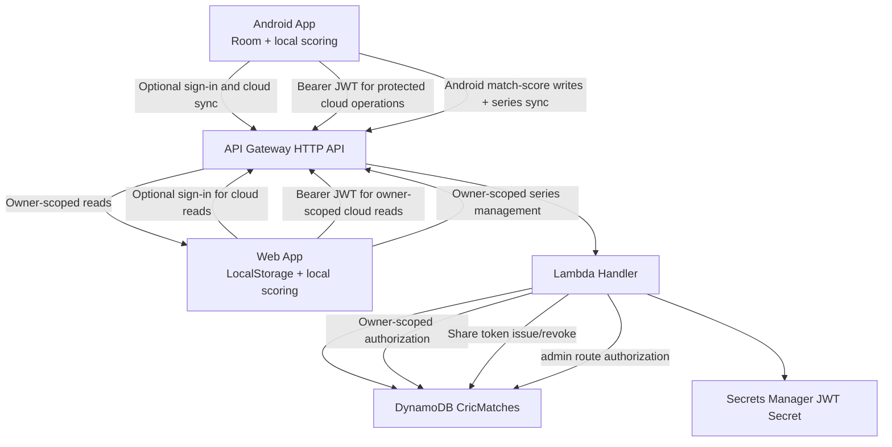

# CricLeague Authentication & AWS Backend Integration

## Purpose
This document captures:
- Current implemented authentication architecture (Android + Web + AWS)
- How optional cloud sign-in and Android-to-cloud sync are wired today
- Security controls and non-breaking constraints
- Target options (AWS Cognito or Firebase bridge)
- Recommended migration plan with regression gates

## 1. Current Architecture (Implemented)

### 1.1 Optional Cloud Sign-In
1. When a user chooses a cloud feature, the client calls `/auth/register` or `/auth/login`.
2. Lambda validates input and authenticates user credentials.
3. Lambda returns:
   - `token` (custom JWT)
   - `user` object (userId, email, name)
4. Android and Web store their sessions separately and send `Authorization: Bearer <token>` to protected cloud APIs.
5. Both apps use the same backend identity; signing in with the same email resolves to the same `userId`.
6. Sign-in is not required for local scoring, matches, teams, or series.

### 1.2 Data Ownership Model
- Every protected entity is scoped by `ownerUserId`.
- Routes verify ownership before update/delete/read where applicable.
- Core resources:
  - MATCH
  - TOURNAMENT
  - PLAYER
  - USER
  - AUDIT_LOG / ERROR_LOG

### 1.3 Spectator Security Model
- Spectator share links use token versioning (`spectatorTokenVersion`).
- New share token rotates version and invalidates previous links.
- Revoke share increments version and invalidates all previously issued tokens.
- Spectator mode is read-only at UI and API boundaries.

### 1.4 Admin Security Model
- Admin APIs under `/admin/*` are backend-protected.
- UI visibility alone is not trusted.
- Backend checks JWT user + admin allowlist/role before serving admin data.

## 2. Current Clients

### 2.1 Web
- Auth/session state and API calls use a storage adapter.
- Local scoring and browser data are available without an account.
- Sign-in is optional and enables owner-scoped cloud reads and series management; Web match-scoring writes remain disabled by the one-way sync policy.
- Signed-out and account-scoped browser data use separate LocalStorage namespaces.

### 2.2 Android
- Cloud session handled by `CloudSyncManager`.
- Uses same AWS endpoints as Web.
- Room-backed scoring and app navigation work without sign-in.
- Signed-out data stays in the legacy guest Room database; each cloud user gets a separate profile database and global-player preference namespace.
- Account changes switch the active local profile and clear the active match/spectator state; backup claiming is explicit and ownership checked.
- Optional sign-in enables Android-to-cloud match and series sync; pending operation queues support delayed sync when network is unstable.
- Creating or revoking cloud spectator links requires the authenticated match owner.
- Spectator live access remains read-only and does not require a scorer account.

## 3. Security Controls (Current)

### 3.1 Backend
- Password hashing with bcrypt.
- JWT verification on protected APIs.
- Email syntax/quality checks and blocked domains.
- Ownership checks (`ownerUserId`) for protected records.
- Security response headers baseline.

### 3.2 Client
- Local scoring and navigation do not require authentication.
- Protected cloud operations require a valid JWT and backend ownership checks.
- Web consumes cloud match data read-only and can manage owner-scoped series metadata; Android is the match-score cloud writer.
- Spectator mode edit locks in scoring surfaces.
- Sign-in prompts appear for cloud operations, not as app-entry gates.

## 4. Non-Breaking Constraints (Must Keep)

1. Preserve `/auth/register` and `/auth/login` response contract until all clients migrate.
2. Preserve stable `ownerUserId` mapping for existing stored data.
3. Do not weaken spectator read-only guarantees.
4. Keep backend authorization as source of truth for admin routes.
5. Keep local-first app navigation available without sign-in; enforce authentication at protected cloud API boundaries.

## 5. Target Authentication Options

## Option A: AWS Cognito (Recommended AWS-native)
Pros:
- Native AWS integration, managed user pool, standards-based tokens
- Easier long-term policy control and federation

Cons:
- Requires claim mapping compatibility work for existing `ownerUserId`
- Requires migration and dual-token validation period

## Option B: Firebase Sign-In + AWS Bridge
Pros:
- Strong mobile SDK experience and quick social sign-in setup

Cons:
- Adds cross-provider complexity
- Must bridge Firebase token to existing backend identity model

## 6. Recommended Target Pattern (No Regression)

Use a compatibility bridge first:
1. Accept new provider token at a dedicated auth exchange endpoint.
2. Validate provider token server-side.
3. Map provider identity to stable internal `userId`.
4. Issue current-compatible app JWT (existing contract).
5. Keep legacy login active during transition.

This avoids breaking Android/Web clients already using current JWT flows.

## 7. Migration Plan (Phased)

### Phase 0: Baseline & Freeze
- Freeze current auth API contract.
- Snapshot regression tests for:
  - login/register
  - match/tournament/player CRUD
  - spectator share/revoke/read-only
  - admin access controls

### Phase 1: Introduce New Provider (Additive)
- Add provider sign-in endpoint(s) without removing existing endpoints.
- Keep legacy auth active.

### Phase 2: Dual Validation
- Support both legacy JWT and provider-bridged JWT.
- Ensure stable `ownerUserId` mapping.

### Phase 3: Client UI Integration
- Add provider sign-in entry points to Android and Web.
- Keep existing email/password fallback until migration is complete.

### Phase 4: Security Hardening
- Add rate limiting and abuse throttling.
- Add challenge-based anti-bot controls when thresholds are exceeded.
- Improve token lifecycle (short-lived access + refresh rotation).

### Phase 5: Controlled Rollout
- Internal users first.
- Canary percentage rollout.
- Full rollout after regression and telemetry sign-off.

## 8. Regression Gate Checklist

Release must fail if any check fails:
1. Sign-in and session restore works on Android and Web.
2. Local scoring and navigation work without sign-in; protected cloud APIs reject unauthenticated requests.
3. Existing user data still resolves under same `ownerUserId`.
4. Spectator read-only cannot edit score, teams, bowlers, or balls.
5. Share token rotation/revoke invalidates old links.
6. Admin routes remain backend-restricted.
7. Android match sync works after login, including reconnect scenarios, and Web reads the resulting cloud snapshot without writing match scores.

## 9. Threat & Abuse Checklist

1. Brute-force protection:
- Per-IP and per-identity throttling
- Temporary lockout windows

2. Bot account creation:
- Risk-based challenge (CAPTCHA/Turnstile) after threshold

3. Token theft risk:
- Reduce token lifetime
- Move toward safer storage and refresh model

4. Monitoring:
- Log failed auth attempts
- Track suspicious share-token churn
- Track admin route denial spikes

## 10. Operational Notes

- Keep API base endpoint configurable per environment.
- Keep auth and authorization test suite mandatory in CI.
- Maintain a rollback switch to legacy auth path during migration.

## Conclusion
Current implementation is functional and already enforces key protections (ownership, spectator read-only, admin backend auth). The safest path forward is additive provider integration with a compatibility bridge, not direct replacement.
