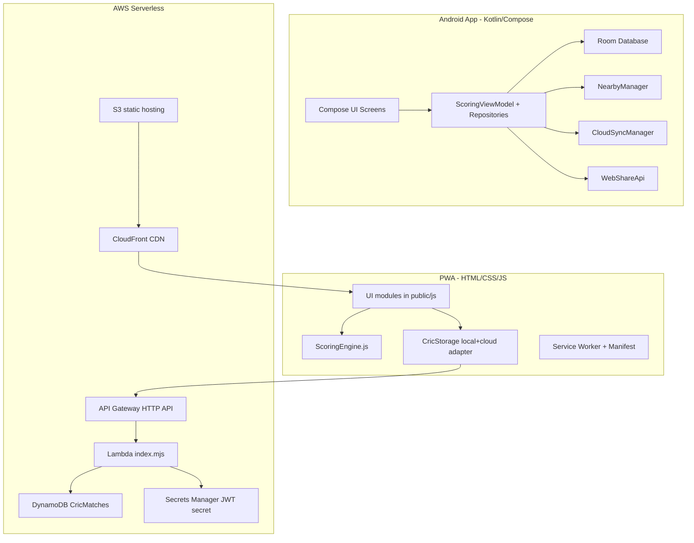
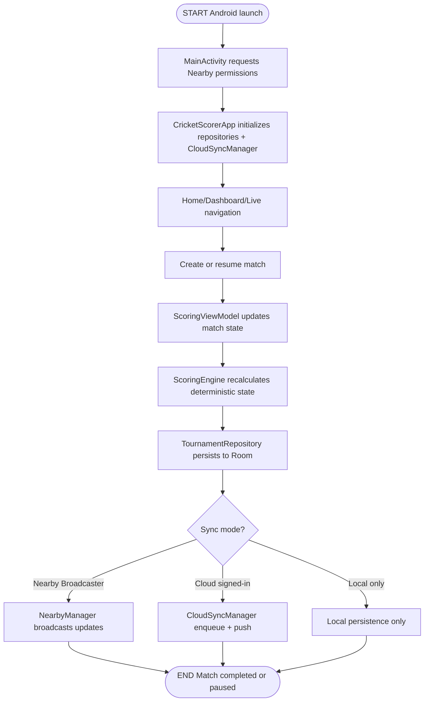
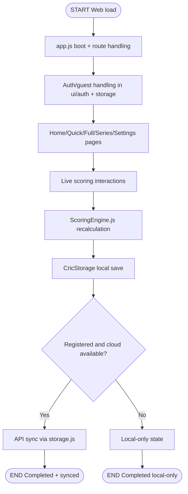
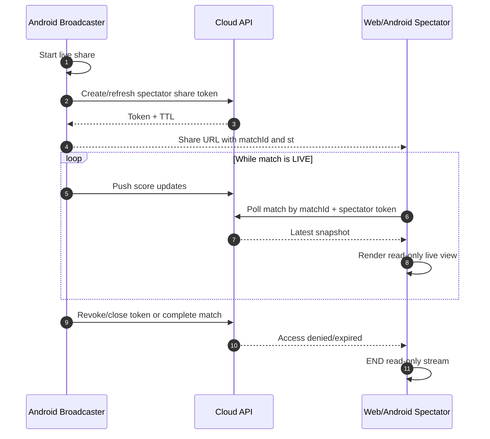
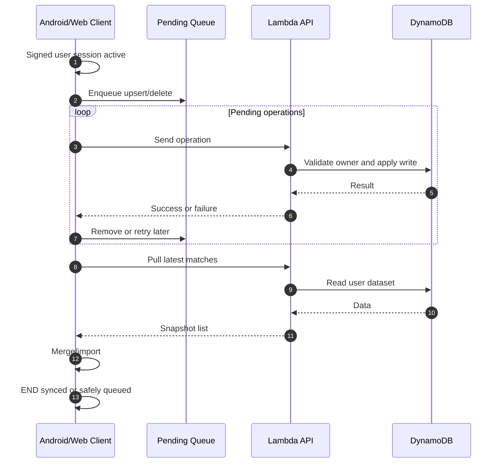

# CricLeague Complete Architecture Document (Android + Web)

Date: 2026-09-30

## 1. Scope and Purpose
This document describes:
- End-to-end architecture of both apps (Android and Web)
- Deployment/runtime configuration across mobile, PWA, and AWS backend
- Integration design for Live Share and Cloud Sync
- Purpose of first-party Kotlin, JavaScript, and TypeScript files

This is intended as a single technical reference for development, QA, UAT, and release planning.

## 2. Repositories in Scope
- Android app: CricketScorer
- Web app and serverless backend: CricketScorer-web

## 3. High-Level Architecture

## 4. Runtime and Integration Flows

### 4.1 Android Individual Flow (Start to End)

### 4.2 Web Individual Flow (Start to End)

### 4.3 Android-Web Live Share Flow

### 4.4 Cloud Sync Flow (Signed User)

## 5. Configuration Architecture

## 5.1 Android Configuration
- Build system: Gradle Kotlin DSL
- UI stack: Jetpack Compose
- DB: Room
- Nearby/offline sync: Google Play Services Nearby
- Cloud sync transport: HttpURLConnection + JSON

Primary config files:
- build.gradle.kts (root): global build plugins/repositories
- settings.gradle.kts: project modules and repo policy
- gradle.properties: gradle-level properties
- app/build.gradle.kts:
  - compileSdk 37, targetSdk 36, minSdk 24
  - version sourced from version.properties
  - Compose + KSP + Room schema generation
  - Release signing/proguard/resource shrinking
- version.properties:
  - VERSION_CODE=6
  - VERSION_NAME=1.0.5
- app/src/main/AndroidManifest.xml:
  - INTERNET permission for cloud APIs
  - Bluetooth/Wi-Fi/location permissions for Nearby
  - MainActivity launcher + FileProvider setup

## 5.2 Web + AWS Configuration
- Frontend build/test: npm + TypeScript compiler
- Runtime frontend: static HTML/CSS/JS
- Backend: AWS Lambda (Node.js 22.x) + API Gateway HTTP API
- Data: DynamoDB
- Auth secret: AWS Secrets Manager
- Hosting: S3 + CloudFront

Primary config files:
- package.json:
  - version 1.0.2
  - build: tsc + engine bundling script
  - test: node test after build
  - e2e: Playwright
- tsconfig.json:
  - target ES2022, NodeNext module
  - strict mode enabled
- aws/template.yaml:
  - DynamoDB CricMatches
  - SecretsManager JWT secret
  - S3 bucket + CloudFront OAC + distribution
  - HttpApi routes + CORS allowlist
  - Lambda function wiring and permissions
- aws/samconfig.toml and samconfig.toml:
  - stack deployment defaults
- public/sw.js:
  - service-worker cache namespace for release invalidation

## 6. Backend API Responsibilities (Lambda index.mjs)
The Lambda API layer includes:
- Authentication:
  - POST /auth/register
  - POST /auth/login
- Match APIs:
  - GET /matches
  - POST /matches
  - GET /matches/{id}
  - PUT /matches/{id}
  - DELETE /matches/{id}
- Spectator sharing:
  - POST /matches/{id}/share-token
  - POST /matches/{id}/revoke-share
  - Token verification for read-only spectator links
- Security controls:
  - JWT verification
  - Secrets Manager secret retrieval
  - Ownership checks before reads/writes
  - Security headers in responses

## 7. Android Kotlin File Purpose Catalog

### 7.1 App Core and Navigation
- app/src/main/kotlin/in/nrkmart/cricscore/CricketScorerApp.kt: Application startup, initializes repositories and cloud sync manager.
- app/src/main/kotlin/in/nrkmart/cricscore/MainActivity.kt: Compose host activity, Nearby permission request, and root navigation shell.
- app/src/main/kotlin/in/nrkmart/cricscore/HomeScreen.kt: Home dashboard, entry points for matches, cloud auth/sync, and nearby role actions.
- app/src/main/kotlin/in/nrkmart/cricscore/DashboardScreen.kt: Tournament and match overview dashboard UI.
- app/src/main/kotlin/in/nrkmart/cricscore/LiveScoringScreen.kt: Main live scoring screen wiring UI tabs and score interactions.
- app/src/main/kotlin/in/nrkmart/cricscore/ExploreScreens.kt: Cross-cutting explorer pages (all teams, players, matches).
- app/src/main/kotlin/in/nrkmart/cricscore/TournamentDetailsScreen.kt: Per-tournament details, teams, fixtures, and match launch.

### 7.2 Domain, State, and Rules
- app/src/main/kotlin/in/nrkmart/cricscore/Models.kt: Core domain models (match, team, player, ball, enums, stats).
- app/src/main/kotlin/in/nrkmart/cricscore/ScoringEngine.kt: Deterministic cricket scoring/replay engine and rule calculations.
- app/src/main/kotlin/in/nrkmart/cricscore/ScoringViewModel.kt: Live match orchestration, pending actions, sync mode behavior, and UI state aggregation.
- app/src/main/kotlin/in/nrkmart/cricscore/TournamentViewModel.kt: Tournament-scoped view model state/actions.

### 7.3 Data and Repository Layer
- app/src/main/kotlin/in/nrkmart/cricscore/TournamentRepository.kt: Primary persistence repository; Room integration, import/export, standings recalculation, match CRUD.
- app/src/main/kotlin/in/nrkmart/cricscore/GlobalPlayerRepository.kt: Global player playlist store and operations.
- app/src/main/kotlin/in/nrkmart/cricscore/GullyRulesRepository.kt: Gully rules settings persistence and retrieval.

### 7.4 Integration and Sync Layer
- app/src/main/kotlin/in/nrkmart/cricscore/CloudSyncManager.kt: Signed-user cloud session, auth, pending queue, retry, upsert/delete/pull match sync.
- app/src/main/kotlin/in/nrkmart/cricscore/NearbyManager.kt: Offline nearby connectivity, broadcaster/spectator role handling, compressed payload broadcast/receive.
- app/src/main/kotlin/in/nrkmart/cricscore/WebShareApi.kt: Parses live-share URL and fetches shared match snapshots from web endpoint.
- app/src/main/kotlin/in/nrkmart/cricscore/SharingUtils.kt: Share/export helpers used by UI actions.

### 7.5 Room Database Layer
- app/src/main/kotlin/in/nrkmart/cricscore/db/CricketDatabase.kt: Room database definition and singleton access.
- app/src/main/kotlin/in/nrkmart/cricscore/db/Entities.kt: Room entities for tournaments, teams, players, matches, balls.
- app/src/main/kotlin/in/nrkmart/cricscore/db/Daos.kt: DAO interfaces and query contracts.
- app/src/main/kotlin/in/nrkmart/cricscore/db/Converters.kt: Room type converters for complex model fields.
- app/src/main/kotlin/in/nrkmart/cricscore/db/Migrations.kt: Schema migration logic across DB versions.

### 7.6 Compose UI Component Library
- app/src/main/kotlin/in/nrkmart/cricscore/ui/Branding.kt: Reusable branding/header UI blocks.
- app/src/main/kotlin/in/nrkmart/cricscore/ui/CaptureArea.kt: Capture/export-friendly composable container.
- app/src/main/kotlin/in/nrkmart/cricscore/ui/ChartComponents.kt: Reusable chart model/UI components.
- app/src/main/kotlin/in/nrkmart/cricscore/ui/LiveScoringComponents.kt: Core live scoring widgets and states.
- app/src/main/kotlin/in/nrkmart/cricscore/ui/MatchSummaryViews.kt: Match summary cards and end-result views.
- app/src/main/kotlin/in/nrkmart/cricscore/ui/OversViews.kt: Over-by-over timeline views.
- app/src/main/kotlin/in/nrkmart/cricscore/ui/PlayerProfileDialog.kt: Player profile modal with quick stats.
- app/src/main/kotlin/in/nrkmart/cricscore/ui/PlayerStatsCalculator.kt: Player statistics aggregation logic.
- app/src/main/kotlin/in/nrkmart/cricscore/ui/ScorecardViews.kt: Batting/bowling scorecard view components.
- app/src/main/kotlin/in/nrkmart/cricscore/ui/ScoringComponents.kt: Shared scoring UI controls and pickers.
- app/src/main/kotlin/in/nrkmart/cricscore/ui/ScoringDialogs.kt: Match setup/toss/decision and action dialogs.
- app/src/main/kotlin/in/nrkmart/cricscore/ui/ScoringOverlays.kt: Overlays for innings/over transitions and prompts.
- app/src/main/kotlin/in/nrkmart/cricscore/ui/ScoringUtils.kt: UI helper formatting/color conversion utilities.
- app/src/main/kotlin/in/nrkmart/cricscore/ui/StatsViews.kt: Stats tab components and derived statistics rendering.
- app/src/main/kotlin/in/nrkmart/cricscore/ui/theme/Theme.kt: Compose theme binding and color scheme setup.
- app/src/main/kotlin/in/nrkmart/cricscore/ui/theme/Type.kt: Typography definitions.

## 8. Web JavaScript and TypeScript File Purpose Catalog

### 8.1 TypeScript Source of Truth
- src/engine/ScoringEngine.ts: Authoritative scoring engine source used to generate browser runtime engine.
- src/models/types.ts: Type definitions and helper type guards/utilities for scoring model.

### 8.2 Frontend Bootstrap and Core
- public/js/app.js: App bootstrap, route handling, spectator mode startup, global event wiring.
- public/js/core/state.js: Shared mutable app state and state helper functions.
- public/js/core/nav.js: Navigation, screen switching, bottom-nav visibility rules.
- public/js/core/toast.js: Toast notifications and user feedback channel.
- public/js/utils/dom.js: DOM utility helpers (colors, download helpers, safe operations).

### 8.3 Persistence and Offline/Cloud Bridge
- public/js/storage.js: Local-first storage adapter, auth, cloud API calls, background sync queue, fallback behavior.
- public/sw.js: Service worker caching/offline app shell strategy and versioned cache key.

### 8.4 UI Feature Modules
- public/js/ui/auth.js: Login/register/guest UI flow, modal focus/accessibility behavior.
- public/js/ui/home.js: Landing/home UX and CTA orchestration by user mode.
- public/js/ui/live-scoring.js: Live scoring interactions, share/revoke links, spectator constraints, result modal behavior.
- public/js/ui/match-setup.js: Match setup wizard flow (teams/overs/toss) and progression logic.
- public/js/ui/modals.js: Modal lifecycle controls and shared modal action wrappers.
- public/js/ui/scorecard.js: Scorecard rendering and export/snapshot actions.
- public/js/ui/series.js: Series workflow and series-level actions.
- public/js/ui/settings.js: Settings import/export and device sync status UX.
- public/js/ui/stats.js: Advanced statistics rendering and breakdown sections.

### 8.5 Generated/Runtime Engine
- public/js/scoring-engine.js: Compiled engine runtime consumed by frontend; generated from src/engine/ScoringEngine.ts.

## 9. Backend JavaScript File Purpose Catalog
- aws/lambda/index.mjs: Single Lambda API handler implementing auth, match CRUD, spectator token APIs, and security/ownership checks.
- aws/lambda/index.test.mjs: Node test suite with mocked DynamoDB client validating auth, migration, and route behavior.

## 10. Security and Access Model

### 10.1 Authentication and Authorization
- Registered mode uses JWT bearer tokens.
- Guest mode is local-first and restricted from privileged cloud operations.
- Spectator links use scoped spectator tokens with match binding and version checks.

### 10.2 Ownership and Data Isolation
- Backend checks owner identity before sensitive reads/writes.
- Match write paths validate ownership/doc type to prevent cross-user overwrite.

### 10.3 Transport and Headers
- HTTPS via CloudFront/API Gateway.
- Lambda responses include security headers (content-type options, frame/referrer/policy headers).

## 11. Persistence Strategy
- Android: Room as source of persisted local truth, with import/export and sync overlays.
- Web: LocalStorage source with optional strict cloud mode for signed users.
- Cloud: DynamoDB table keyed by matchId with per-user ownership semantics.

## 12. Build, Test, and Release Summary

### 12.1 Android
- Version source: version.properties
- Build: Gradle Kotlin DSL app module
- Packaging: APK/AAB copy helper in app/build.gradle.kts

### 12.2 Web
- Build pipeline: TypeScript compile + engine bundling script
- Unit tests: node test on dist output
- E2E tests: Playwright test suite
- Deployment: SAM stack + static assets sync to S3 + CloudFront invalidation

## 13. Operational Notes
- Keep ScoringEngine.ts and generated scoring-engine.js in sync via build scripts only.
- Update service worker cache namespace on web release to avoid stale assets.
- Preserve API contract compatibility between Android CloudSyncManager/Web storage adapter and Lambda routes.
- Keep CORS allowlist aligned with production domains in aws/template.yaml.

## 14. Document Maintenance Checklist
For each release:
1. Update versions in Android version.properties and web package.json.
2. Update this document for new modules/endpoints/config changes.
3. Verify integration flows (Nearby broadcaster/spectator, Web spectator token path, cloud sync queue retries).
4. Confirm deployment config values and domain mappings remain valid.
